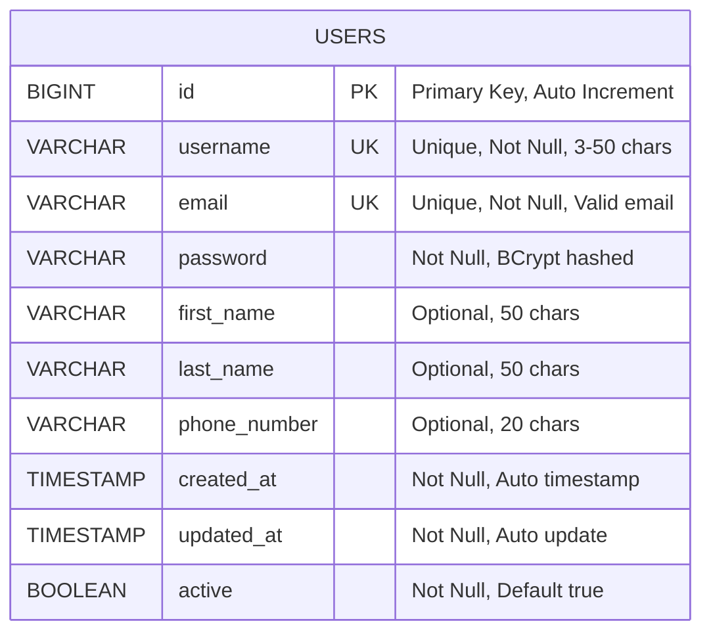

# Entity Relationship Diagram (ERD)
## User Authentication System Database

---

## ERD Diagram



---

## Table Details

### USERS Table

**Purpose**: Stores user account information and authentication credentials

**Columns**:

| Column Name | Data Type | Constraints | Description |
|-------------|-----------|-------------|-------------|
| id | BIGINT | PRIMARY KEY, AUTO_INCREMENT | Unique identifier for each user |
| username | VARCHAR(50) | NOT NULL, UNIQUE | User's unique username (3-50 characters) |
| email | VARCHAR(100) | NOT NULL, UNIQUE | User's email address (must be valid format) |
| password | VARCHAR(255) | NOT NULL | BCrypt encrypted password |
| first_name | VARCHAR(50) | NULL | User's first name (optional) |
| last_name | VARCHAR(50) | NULL | User's last name (optional) |
| phone_number | VARCHAR(20) | NULL | User's phone number (optional) |
| created_at | TIMESTAMP | NOT NULL | Timestamp when user was created |
| updated_at | TIMESTAMP | NOT NULL | Timestamp when user was last updated |
| active | BOOLEAN | NOT NULL, DEFAULT TRUE | Account status flag |

---

## Indexes

| Index Name | Columns | Type | Purpose |
|------------|---------|------|---------|
| PRIMARY | id | Primary Key | Unique identifier |
| idx_username | username | Unique Index | Fast username lookup |
| idx_email | email | Unique Index | Fast email lookup |

---

## Relationships

**Note**: Current version (Lab 1) has a single table design. Future versions may include:
- User Roles table (one-to-many)
- User Sessions table (one-to-many)
- User Profile Details table (one-to-one)
- Password Reset Tokens table (one-to-many)

---

## Database Configuration

**Database Name**: `user_auth_db`  
**Character Set**: UTF-8  
**Collation**: utf8mb4_unicode_ci  
**Storage Engine**: InnoDB  
**Auto-commit**: Enabled  

---

## Sample Data

```sql
-- Example user record
INSERT INTO users (username, email, password, first_name, last_name, phone_number, active)
VALUES (
    'john_doe',
    'john@example.com',
    '$2a$10$N9qo8uLOickgx2ZMRZoMye1J...',  -- BCrypt hash
    'John',
    'Doe',
    '+1234567890',
    TRUE
);
```

---

## SQL Scripts

### Create Table

```sql
CREATE TABLE users (
    id BIGINT AUTO_INCREMENT PRIMARY KEY,
    username VARCHAR(50) NOT NULL UNIQUE,
    email VARCHAR(100) NOT NULL UNIQUE,
    password VARCHAR(255) NOT NULL,
    first_name VARCHAR(50),
    last_name VARCHAR(50),
    phone_number VARCHAR(20),
    created_at TIMESTAMP DEFAULT CURRENT_TIMESTAMP,
    updated_at TIMESTAMP DEFAULT CURRENT_TIMESTAMP ON UPDATE CURRENT_TIMESTAMP,
    active BOOLEAN DEFAULT TRUE NOT NULL,
    INDEX idx_username (username),
    INDEX idx_email (email)
) ENGINE=InnoDB DEFAULT CHARSET=utf8mb4 COLLATE=utf8mb4_unicode_ci;
```

---

**Document Version**: 1.0  
**Last Updated**: February 7, 2026  
**Author**: G5 - Canadilla
