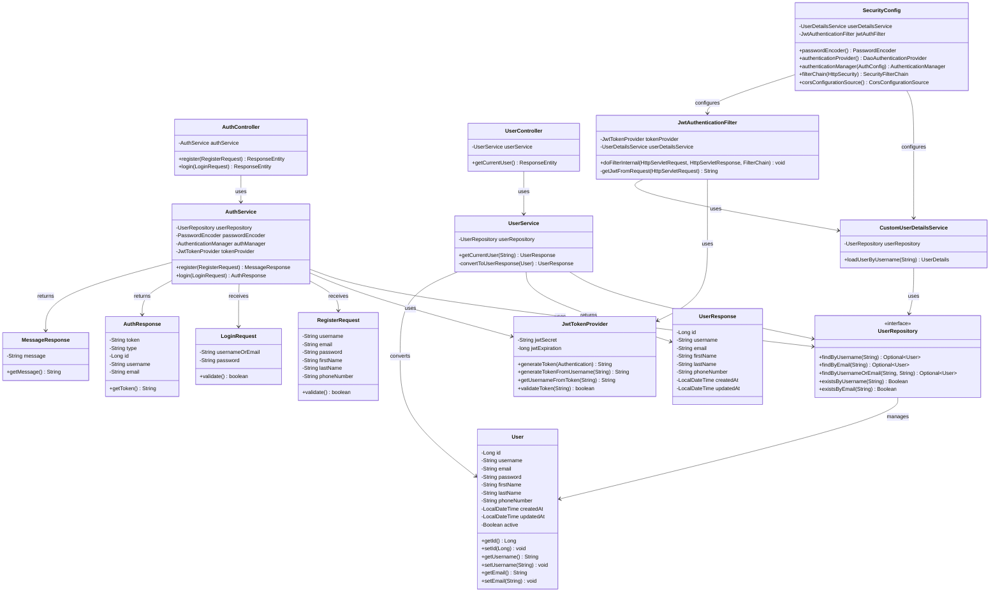

# UML Class Diagram
## User Authentication System

---

## Class Diagram



---

## Package Structure

```
com.canadilla.userauth
├── entity
│   └── User
├── dto
│   ├── RegisterRequest
│   ├── LoginRequest
│   ├── AuthResponse
│   ├── UserResponse
│   └── MessageResponse
├── repository
│   └── UserRepository
├── service
│   ├── AuthService
│   └── UserService
├── controller
│   ├── AuthController
│   └── UserController
├── security
│   ├── JwtTokenProvider
│   ├── JwtAuthenticationFilter
│   ├── CustomUserDetailsService
│   └── SecurityConfig
└── UserAuthApplication
```

---

## Class Descriptions

### Entity Layer

**User**: JPA entity representing the users table in the database. Contains user account information and authentication credentials.

### DTO Layer

**RegisterRequest**: Data Transfer Object for user registration requests. Contains validation annotations.

**LoginRequest**: DTO for login requests with username/email and password.

**AuthResponse**: DTO for successful authentication responses, includes JWT token and user info.

**UserResponse**: DTO for user profile information (excludes sensitive data like password).

**MessageResponse**: Generic DTO for simple success/error messages.

### Repository Layer

**UserRepository**: Spring Data JPA repository interface for User entity. Provides database operations.

### Service Layer

**AuthService**: Business logic for user registration and authentication. Handles password encryption and JWT generation.

**UserService**: Business logic for user profile operations. Retrieves and formats user information.

### Controller Layer

**AuthController**: REST API endpoints for authentication operations (/api/auth/*).

**UserController**: REST API endpoints for user operations (/api/user/*).

### Security Layer

**JwtTokenProvider**: Utility class for JWT token generation and validation.

**JwtAuthenticationFilter**: Spring Security filter for JWT-based authentication.

**CustomUserDetailsService**: Implementation of UserDetailsService for loading user details.

**SecurityConfig**: Spring Security configuration class. Defines security rules and beans.

---

## Design Patterns Used

1. **Layered Architecture**: Separation of concerns across layers (Controller → Service → Repository → Entity)
2. **Repository Pattern**: Data access abstraction through UserRepository
3. **DTO Pattern**: Data transfer between layers using dedicated DTO classes
4. **Dependency Injection**: Spring's @Autowired for loose coupling
5. **Filter Chain Pattern**: JWT authentication filter in security chain
6. **Factory Pattern**: Spring Security's authentication provider factory

---

**Document Version**: 1.0  
**Last Updated**: February 7, 2026  
**Author**: G5 - Canadilla
