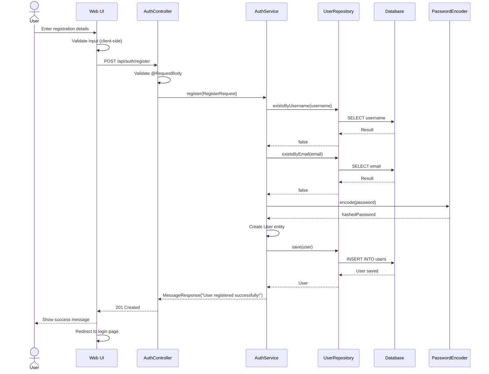
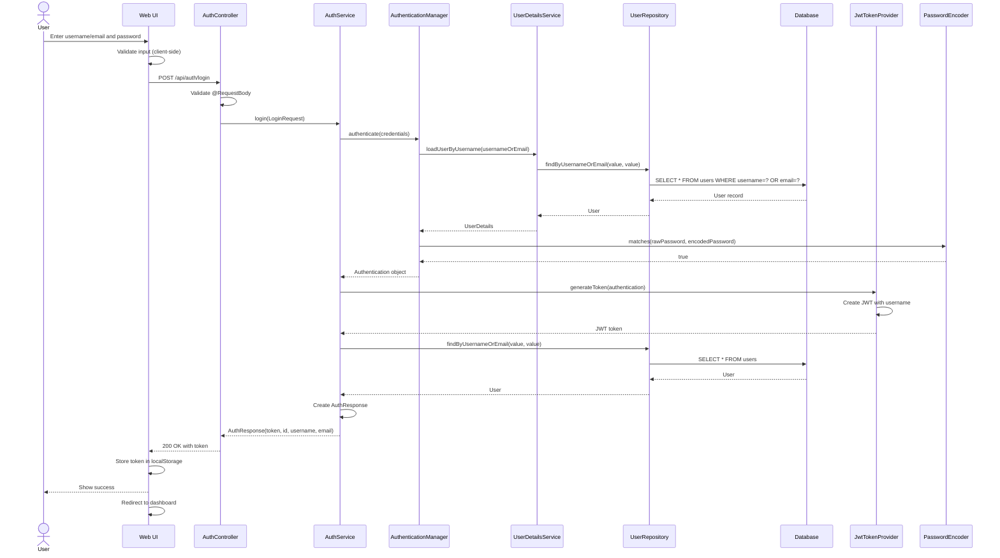
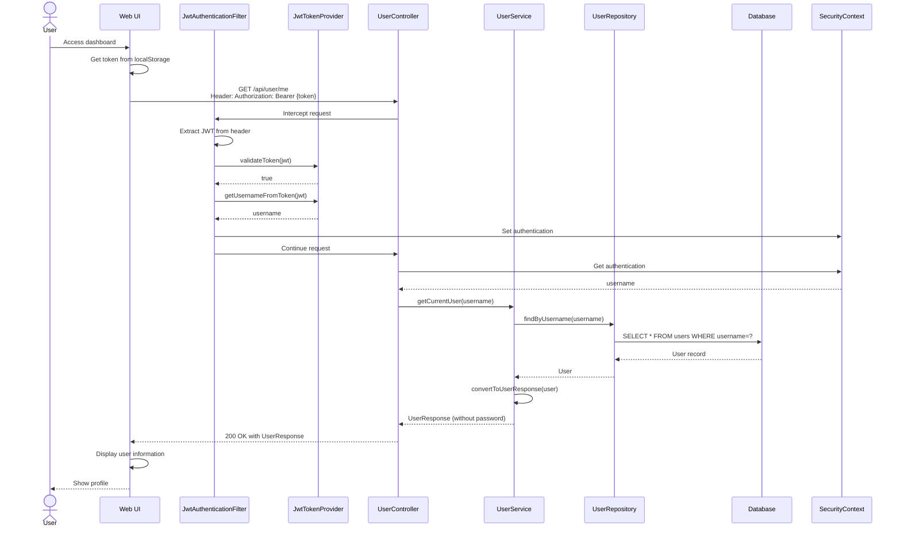
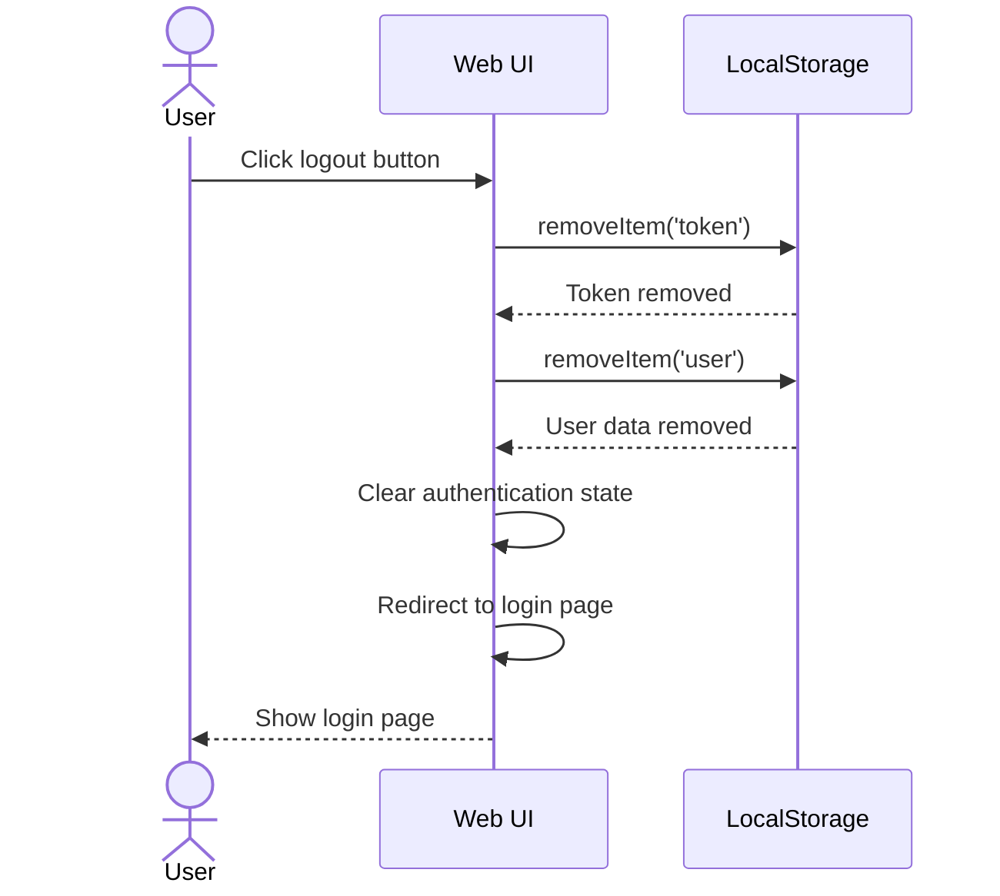
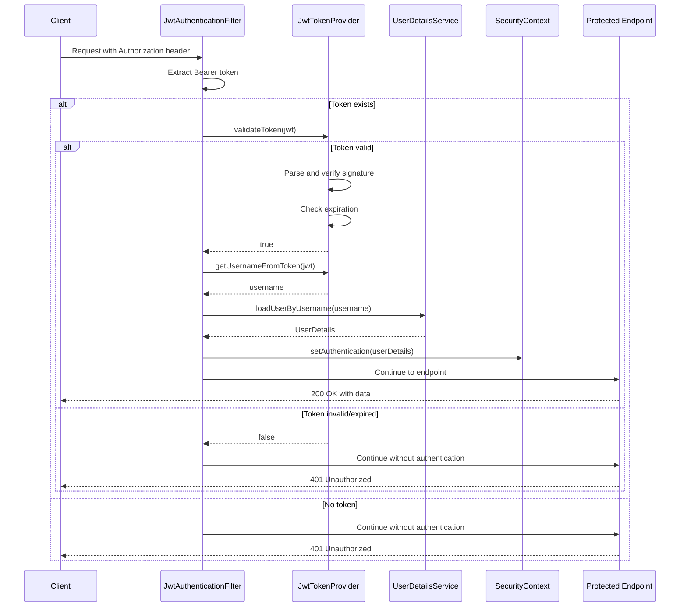

# UML Sequence Diagrams
## User Authentication System

---

## 1. User Registration Flow

---

## 2. User Login Flow

---

## 3. Get Current User Profile Flow

---

## 4. User Logout Flow

---

## 5. JWT Token Validation Flow

---

## Flow Descriptions

### 1. User Registration Flow
1. User fills registration form on web UI
2. Client-side validation checks input
3. POST request sent to `/api/auth/register`
4. Backend validates uniqueness of username and email
5. Password is encrypted using BCrypt
6. User entity is saved to database
7. Success message returned to client
8. User redirected to login page

### 2. User Login Flow
1. User enters credentials on login page
2. POST request sent to `/api/auth/login`
3. Spring Security's AuthenticationManager validates credentials
4. Password is checked using BCrypt
5. If valid, JWT token is generated
6. Token and user info returned to client
7. Client stores token in localStorage
8. User redirected to dashboard

### 3. Get Current User Profile Flow
1. User accesses protected dashboard page
2. JWT token sent in Authorization header
3. JwtAuthenticationFilter intercepts request
4. Token is validated and username extracted
5. Authentication set in SecurityContext
6. UserController retrieves user from database
7. User data (excluding password) returned to client
8. Profile information displayed to user

### 4. User Logout Flow
1. User clicks logout button
2. Client removes token from localStorage
3. Client clears all user data
4. User redirected to login page
5. Protected routes no longer accessible

### 5. JWT Token Validation Flow
1. Every request to protected endpoint includes JWT
2. Filter extracts and validates token
3. If valid, user is authenticated for the request
4. If invalid/expired, 401 Unauthorized returned
5. SecurityContext cleared after request

---

## Key Security Points

- **Password Security**: Passwords never transmitted or stored in plain text
- **Token Security**: JWT tokens expire after 24 hours
- **Stateless Authentication**: No server-side session storage
- **Request Filtering**: All requests pass through JWT filter
- **CORS Protection**: Only configured origins allowed

---

**Document Version**: 1.0  
**Last Updated**: February 7, 2026  
**Author**: G5 - Canadilla
